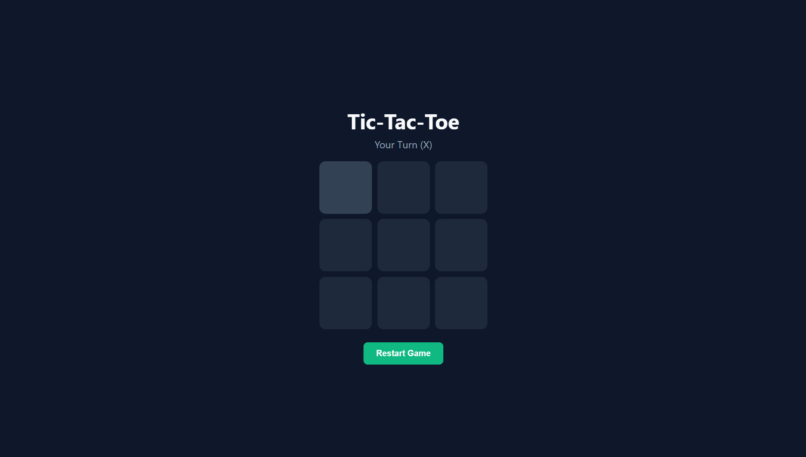
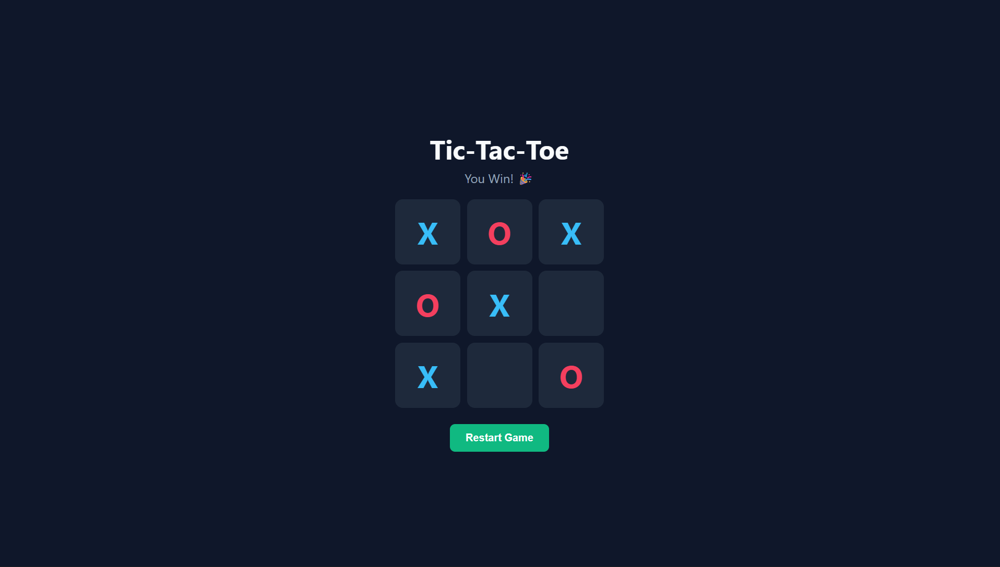
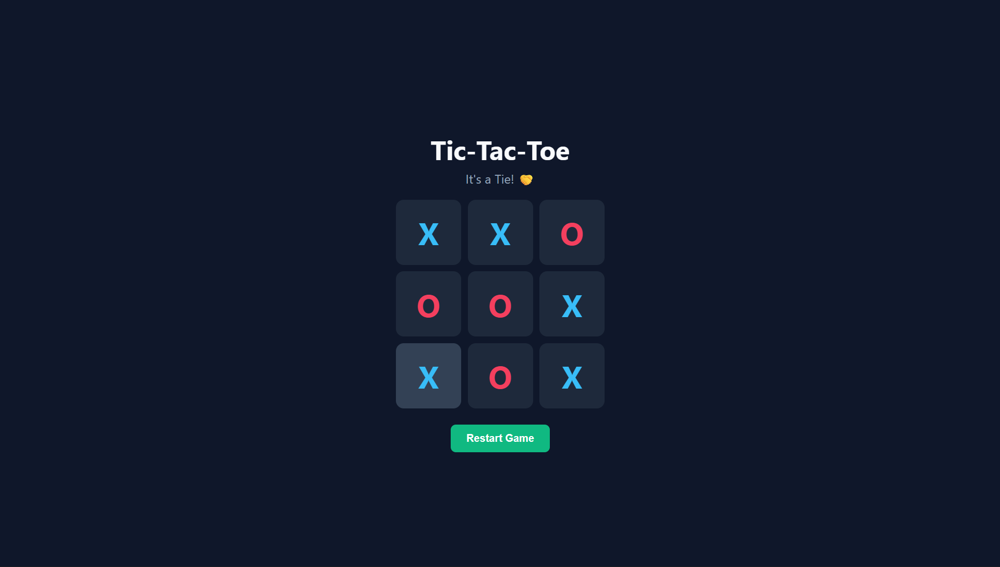

## Tic-Tac-Toe Web application 
--------------------------------------------------------

Its a simple Tic-Tac-Toe web application by implementing functions to handle user clicks, track game state, and check for winning conditions,
users can play against each other or against an AI opponent, aiming to get three markers in a row to win the game.

* Built with
  
    ✿HTML
  
    ✿CSS
  
    ✿JAVASCRIPT

* PREVIEWS

    Basic preview
    

    Winning preview
    

    Other preview
    
